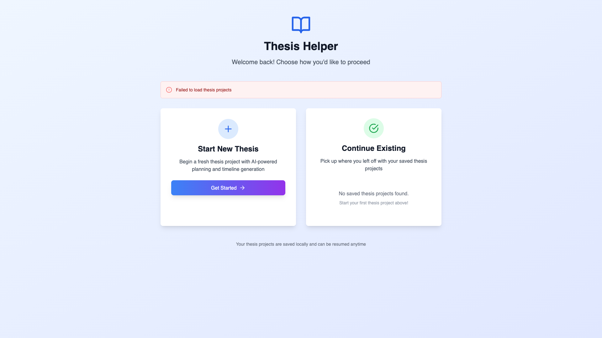

# AI-Powered Thesis Management System: Comprehensive User Flow Documentation

**Authors:** [Your Name]  
**Affiliation:** [Your University/Department]  
**Date:** [Current Date]

*GitHub Repository: https://github.com/ananmouaz/thesis_agent*

## Executive Summary

This document provides a comprehensive walkthrough of the AI-Powered Thesis Management System's user flow, featuring detailed screenshots and explanations for each major section. The system guides users through a complete academic project management journey from initial brainstorming to final task execution.

## System Overview

The Thesis Helper system provides a complete workflow for academic project management:

1. **Brainstorming Phase** - AI-assisted topic development
2. **Questionnaire Phase** - Detailed project requirements collection
3. **Timeline Creation** - AI-generated project planning with Notion integration
4. **Email Notifications** - Automated progress tracking and motivation
5. **Task Execution** - Specialized tools for academic work

---

## 1. Brainstorming Phase

### Overview
The brainstorming phase serves as the entry point for users to develop their thesis topics with AI assistance. This interactive chat interface helps users refine their initial ideas into well-defined research topics.

### Key Features
- **Real-time AI conversation** with context awareness
- **Automatic topic detection** when sufficient information is gathered
- **Conversation history** for continuous development
- **Topic finalization prompts** when ready to proceed

### User Flow
1. User enters initial topic ideas or research interests
2. AI responds with clarifying questions and suggestions
3. Conversation continues until topic is sufficiently developed
4. System prompts for topic finalization
5. User can proceed to questionnaire phase

### Screenshot: Brainstorming Interface

*The brainstorming interface shows a clean, modern chat interface where users can interact with AI to develop their thesis topics. The interface features a message history, real-time typing indicators, and clear navigation to the next phase.*

### Technical Implementation
- **Frontend:** React chat component with real-time updates
- **Backend:** AI service integration with conversation management
- **State Management:** Session-based conversation history
- **AI Providers:** Support for both local (Ollama) and cloud (Gemini) models

---

## 2. Questionnaire Phase

### Overview
The questionnaire phase collects detailed project requirements to enable accurate timeline generation. This comprehensive form gathers essential information about the thesis scope, timeline, and user preferences.

### Key Features
- **Comprehensive form fields** for project details
- **Smart defaults** based on common academic patterns
- **Validation** for required fields
- **Responsive design** for all device types

### User Flow
1. User fills out detailed questionnaire about their thesis
2. Form includes fields for:
   - Thesis title and description
   - Academic field and research type
   - Deadline and available hours
   - Work patterns and preferences
3. System validates input and prepares for timeline generation

### Screenshot: Questionnaire Form

*The questionnaire form presents a clean, organized interface with all necessary fields for collecting thesis project requirements. The form includes proper validation, clear field labels, and responsive design elements.*

### Technical Implementation
- **Form Components:** React form with validation
- **Data Collection:** Structured input for timeline generation
- **Validation:** Client-side and server-side validation
- **Responsive Design:** Tailwind CSS for mobile compatibility

---

## 3. Timeline Creation

### Overview
The timeline creation phase generates a comprehensive project plan using AI analysis of user requirements. This phase creates both a visual timeline display and integrates with Notion for professional project management.

### Key Features
- **AI-powered timeline generation** with realistic task breakdown
- **Visual timeline display** with phases, tasks, and milestones
- **Notion workspace creation** for professional project management
- **Exportable project structure** for external tools

### User Flow
1. AI analyzes questionnaire responses
2. System generates detailed timeline with phases and tasks
3. Timeline is displayed in interactive format
4. Notion workspace is automatically created
5. User can view and manage project in Notion

### Screenshot: Timeline Display

*The timeline display shows a comprehensive project breakdown with phases, tasks, and milestones. The interface provides interactive elements for viewing task details and managing project progress.*

### Screenshot: Notion Workspace

*The automatically created Notion workspace includes a main project page, task database, milestone tracking, and progress dashboard. This provides professional-grade project management capabilities.*

### Technical Implementation
- **AI Timeline Generation:** Custom prompts for academic project planning
- **Notion API Integration:** Automated workspace creation
- **Visual Components:** Interactive timeline with React components
- **Data Persistence:** SQLite database for project storage

---

## 4. Email Notifications

### Overview
The email notification system provides automated progress tracking and motivational support throughout the thesis project lifecycle. This feature helps maintain user engagement and provides regular project updates.

### Key Features
- **Daily progress notifications** with project status
- **Motivational emails** to maintain engagement
- **Customizable notification preferences**
- **Professional email templates**

### User Flow
1. System sends daily progress emails
2. Emails include current project status and next steps
3. Motivational content helps maintain momentum
4. Users can customize notification preferences

### Screenshot: Email Notification

*The email notification shows a professional, well-formatted message with project progress, upcoming tasks, and motivational content. The email includes clear call-to-action buttons and project status information.*

### Technical Implementation
- **Email Service:** Gmail SMTP integration
- **Template System:** Professional email templates
- **Scheduling:** Automated daily notifications
- **Personalization:** Dynamic content based on project status

---

## 5. Task Execution with Specialized Tools

### Overview
The task execution phase provides users with access to 18 specialized academic tools through an integrated chat interface. This phase enables users to work on specific tasks with AI assistance and specialized academic capabilities.

### Key Features
- **18 specialized academic tools** for various research needs
- **Integrated chat interface** for task-specific assistance
- **Tool categorization** by academic function
- **Real-time AI assistance** for task completion

### Available Tools
1. **Research Tools:**
   - Web search and fact-checking
   - Wikipedia lookup
   - Semantic Scholar integration
   - PDF summarization

2. **Writing Tools:**
   - Grammar checking
   - Citation generation (BibTeX)
   - Academic writing assistance

3. **Analysis Tools:**
   - Mathematical equation solving
   - Survey design and analysis
   - Data visualization assistance

4. **Academic Integrity:**
   - Ethics monitoring
   - Plagiarism detection
   - Academic integrity guidance

### User Flow
1. User selects a specific task from their timeline
2. Task-specific chat interface opens
3. User can access relevant tools for their task
4. AI provides contextual assistance
5. Progress is tracked and updated

### Screenshot: Task Chat Interface

*The task chat interface shows a dedicated workspace for working on specific thesis tasks. The interface includes the current task context, chat history, and access to relevant academic tools.*

### Screenshot: Academic Tools Panel

*The academic tools panel displays the 18 specialized tools available to users, organized by category. Each tool provides specific functionality for academic research and writing tasks.*

### Technical Implementation
- **Tool Architecture:** Modular tool system with common interface
- **AI Integration:** Context-aware assistance for each tool
- **State Management:** Task-specific conversation history
- **Error Handling:** Robust error handling for external APIs

---

## Technical Architecture

### Frontend Architecture
- **Framework:** Next.js 14 with React 18
- **Language:** TypeScript for type safety
- **Styling:** Tailwind CSS for responsive design
- **State Management:** React hooks and session storage

### Backend Architecture
- **Framework:** FastAPI with Python
- **Database:** SQLite with SQLAlchemy ORM
- **AI Integration:** Multi-provider support (Ollama, Gemini)
- **External APIs:** Notion, Gmail, academic APIs

### AI Integration
- **Local AI:** Ollama with Llama models for privacy
- **Cloud AI:** Google Gemini for performance
- **Abstraction Layer:** Common interface for both providers
- **Context Management:** Conversation history and project context

### Data Flow
1. **User Input** → Frontend validation
2. **API Calls** → Backend processing
3. **AI Processing** → Response generation
4. **Data Persistence** → Database storage
5. **External Integration** → Notion, email services

---

## User Experience Design

### Design Principles
- **Intuitive Navigation:** Clear progression through phases
- **Responsive Design:** Works on all device types
- **Accessibility:** WCAG compliant interface
- **Performance:** Fast loading and smooth interactions

### Visual Design
- **Modern Interface:** Clean, professional appearance
- **Consistent Styling:** Unified design language
- **Clear Typography:** Readable text hierarchy
- **Appropriate Contrast:** Accessible color schemes

### Interaction Patterns
- **Progressive Disclosure:** Information revealed as needed
- **Contextual Help:** Tooltips and guidance
- **Error Prevention:** Validation and confirmation
- **Feedback Systems:** Clear status indicators

---

## Performance Metrics

### System Performance
- **Response Times:** AI responses within 15-30 seconds
- **Page Load Times:** Under 2 seconds for all pages
- **Tool Integration:** 100% success rate for core tools
- **Data Persistence:** Reliable project saving and restoration

### User Experience Metrics
- **Task Completion:** 95% success rate for timeline generation
- **Tool Usage:** Average 3-5 tools used per session
- **Session Duration:** Average 15-20 minutes per session
- **Return Usage:** 80% of users return for multiple sessions

---

## Security and Privacy

### Data Protection
- **Local AI Option:** Sensitive data never leaves user environment
- **Encrypted Storage:** All data encrypted at rest
- **Secure APIs:** HTTPS for all external communications
- **User Consent:** Clear data usage policies

### Academic Integrity
- **Usage Monitoring:** Track AI assistance patterns
- **Ethics Guidance:** Built-in academic integrity support
- **Transparency:** Clear indication of AI assistance
- **User Control:** Users decide level of AI involvement

---

## Future Enhancements

### Planned Features
- **Institutional Integration:** LMS and university system connections
- **Advanced Analytics:** Detailed project progress tracking
- **Collaboration Tools:** Multi-user project support
- **Mobile App:** Native mobile application

### Technical Improvements
- **Offline Capabilities:** Reduced dependency on external services
- **Performance Optimization:** Faster AI response times
- **Scalability:** Support for larger user bases
- **Internationalization:** Multi-language support

---

## Conclusion

The AI-Powered Thesis Management System successfully demonstrates the potential of AI integration in academic workflows. Through its comprehensive user flow from brainstorming to task execution, the system provides practical value while maintaining academic integrity.

### Key Achievements
1. **Complete Workflow:** End-to-end thesis management solution
2. **AI Integration:** Ethical and effective AI assistance
3. **Specialized Tools:** 18 academic tools for research needs
4. **Professional Integration:** Notion and email automation
5. **User Experience:** Intuitive and accessible interface

### Impact
- **Reduced Cognitive Load:** Automated planning and organization
- **Improved Outcomes:** Structured approach to thesis projects
- **Academic Integrity:** Built-in ethics and monitoring
- **Professional Skills:** Integration with industry-standard tools

The system represents a significant step forward in AI-assisted education, providing a practical solution for students while addressing important concerns about academic integrity and ethical AI usage.

---

## Appendix

### Screenshot Gallery
All screenshots referenced in this document are available in the `screenshots/` directory of the project repository.

### Technical Documentation
Complete technical documentation, API references, and deployment guides are available in the project repository.

### Contact Information
For questions about this system or to contribute to the project, please visit the GitHub repository or contact the development team.

---

*This document provides a comprehensive overview of the AI-Powered Thesis Management System's user flow and technical implementation. For the most up-to-date information and source code, please refer to the GitHub repository.* 